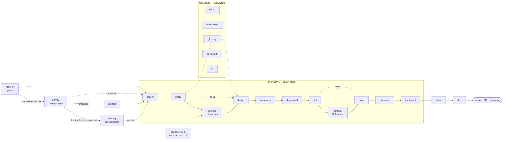

# SDD — Spec-Driven Development for Claude Code

A self-contained Claude Code plugin that carries a feature from a one-line idea to
**reviewed, verified, shipped** code through **23 atomic, stack-agnostic skills** and a
**TDD implementation engine** — with a living decomposition roadmap above the per-feature flow and a
**design pipeline** (design-system · ux-flows · screens) for UI features.

Every skill is Socratic (it walks decisions with you, it doesn't dump a wall of output),
gated (a stage hard-refuses when its prerequisite artifact is missing), and stack-agnostic
(no language, tracker, or test tool is hard-coded — the skills detect what your repo uses).
The Q&A skills are **depth-tunable** (easy / medium / hard) and run on **any Claude plan or
model tier** — no skill requires a specific one; judgment agents default to `opus` and degrade
gracefully when it's unavailable (see [Levers](#levers)).

## The flow

There are three kinds of skill. Most of your time is the **backbone** — a straight line you
walk in order. A few are **utilities** you call whenever you need them. Two **close the loop**
after the code is written.



## Install

**Claude Code** — native plugin:

```text
/plugin marketplace add genkovich/sdd
/plugin install sdd@sdd
```

After updating to a new release: re-run `/plugin install sdd@sdd`, then `/reload-plugins`.

**Codex CLI** — `cd` into your project first (installs into `.agents/skills/` + `.codex/agents/`
of the current directory; `--global` for `~`, `--prefix DIR` for an arbitrary directory):

```sh
cd your-project
curl -fsSL https://raw.githubusercontent.com/genkovich/sdd/main/install.sh | bash -s -- codex
```

Restart codex and type `$sdd-specify`. Alternative: `codex plugin marketplace add genkovich/sdd`,
then **inside codex** `/plugins` → the `sdd` tab → **Install plugin** — registers the
**unprefixed** names (`$specify`) instead of the script's `$sdd-specify`. **Pick one path, not
both** — running both shows every skill twice. Undo: `install.sh codex --uninstall` (script) or
`/plugins` → uninstall (marketplace). Windows: run the installer from Git Bash or WSL — the
dot-directories it writes are hidden by default in Explorer.

**Cursor** (2.4+) — the same script (`.cursor/skills/` + `.cursor/agents/`); restart Cursor (or
**Developer: Reload Window**), then type `/` and pick `sdd-specify`:

```sh
cd your-project
curl -fsSL https://raw.githubusercontent.com/genkovich/sdd/main/install.sh | bash -s -- cursor
```

How every Claude-specific mechanism — `AskUserQuestion`, subagents, `/clear`, the implement
engine modes — maps to Codex / Cursor is one table:
[`skills/_shared/tool-adapters.md`](./skills/_shared/tool-adapters.md).

## First run

The flow is a straight line: **each stage writes a file the next one reads**, and refuses to run
if its input is missing — so you can't skip ahead by accident. The argument every stage takes is
a kebab-case **feature slug** you make up once (here `checkout-discounts`); it becomes
`docs/features/checkout-discounts/`, so use the same slug at every stage.

```text
/sdd:interview                          # optional: pressure-test a raw idea → docs/idea-brief.md
/sdd:survey                             # once per repo: map the current architecture
/sdd:roadmap                            # optional: decompose into steps + waves
/sdd:specify       checkout-discounts   # interview → spec (reads the architecture map)
/sdd:clarify       checkout-discounts
/sdd:ux-flows      checkout-discounts   # UI features only — user flows + screen inventory
/sdd:design        checkout-discounts
/sdd:sequences     checkout-discounts
/sdd:data-model    checkout-discounts
/sdd:api           checkout-discounts
/sdd:screens       checkout-discounts   # UI features only — the per-state screen manifest
/sdd:tasks         checkout-discounts
/sdd:plan-tests    checkout-discounts
/sdd:implement     checkout-discounts
/sdd:review        checkout-discounts   # independent review of the whole change
/sdd:ship          checkout-discounts   # verify it runs, changelog, PR
```

**Every stage ends with a copy-ready handoff block** ([`skills/_shared/handoff.md`](./skills/_shared/handoff.md)) —
*What I did* + *Review before continuing* + *Run next*: **`/clear`**, then the next `/sdd:…`
command, ready to copy. `/clear` matters because each stage **re-reads its inputs from disk**, so
clearing keeps context small instead of letting one stage's chatter drift into the next
(loop-backs like `review` → `implement` are the exception; utilities make it optional):

```md
## ✅ specify — checkout-discounts
**What I did** — wrote docs/features/checkout-discounts/spec.md, size M; commit `spec: checkout-discounts`
**Review** — spec.md: goals, user stories, the §5 acceptance criteria
**Run next** — /clear, then: /sdd:clarify checkout-discounts
```

Three notes: **`classify-size` is optional up front** — `specify` writes `.size` itself when it's
absent; run it only to size *before* specifying, or to re-classify. **Skip the depth question**
with `/sdd:specify checkout-discounts --depth=easy` (also `clarify`/`design`; see [Levers](#levers)).
And **`ux-flows`/`screens` auto-skip** for backend-only work, no confirmation needed.

### Step 0 — survey (once per repo, before the backbone)

| # | Skill | What it does | Reads → Produces |
|---|---|---|---|
| 0 | **survey** | Existing repo → scans once, persists the current architecture. Empty repo → level-adaptive foundation session → fixes the foundation + emits a scaffold `tasks.json` for `scaffold`. | the repo (+ `docs/idea-brief.md` if present) → `docs/architecture-map.md` (+ scaffold `tasks.json` on greenfield) |
| 0b | **scaffold** | *Greenfield only:* materializes the skeleton the foundation planned — sequentially inline, anchored on the **skeleton smoke test** (builds + boots + empty test suite + migration tool) | `architecture-map.md` + `_scaffold/tasks.json` → the committed skeleton |
| 0c | **design-system** | *Once per repo, before the first UI feature:* fixes the committed design canon — the drawing tool (Figma / Pencil / code), platform posture, tokens, component inventory | the repo (+ design MCPs) → `docs/design-system.md` |

### Backbone — the straight line (run in order)

| # | Skill | What it does | Reads → Produces |
|---|---|---|---|
| 1 | **specify** | Interviews you to capture the idea, writes the product spec + acceptance criteria, and risk-gates authoritative domain discovery separately from competitive research | *your idea*, `architecture-map.md` → `spec.md` (+ `discovery.md` when triggered) |
| 2 | **clarify** | Sweeps the spec for ambiguities (a devil's-advocate pass), closes or defers each | `spec.md` → tightened `spec.md` |
| 3 | **ux-flows** | *UI features only (auto-skipped otherwise):* derives one user flow per UI-touching user story (happy + AC-driven error branches) + the `SCR-NN` screen inventory — always markdown+mermaid, whatever the design tool | `spec.md`, `design-system.md` → `ux-flows.md` |
| 4 | **design** | **Matches the feature to your existing architecture** + **declares the target surfaces** (reading `ux-flows.md` as evidence), writes the Arc42 SAD + C4 + ADRs | `spec.md` (+ `ux-flows.md`, `CONTEXT.md` if present) → `sad.md`, `adr/*` |
| 5 | **sequences** | Draws the runtime flows as Mermaid sequence diagrams (UI-driven flows agree with `ux-flows.md`) | `sad.md` → `sad.md §6` |
| 6 | **data-model** | Designs the schema and writes the actual forward+rollback migrations — **staged** under the feature folder, not the live tree (`implement` promotes them) | `spec.md`, `sad.md`, sequences → `data-model.md`, staged `migrations/*.up/down.sql` |
| 7 | **api** | Derives the OpenAPI contract from the data model (or the existing schema on the fast lane) + sequences + spec | `data-model.md`, sequences, `spec.md` → `contracts/openapi.yaml` |
| 8 | **screens** | *UI features only (auto-skipped otherwise):* the canonical screen manifest — every screen in every state (default / loading / empty / error / …), reuse-first components; drawn per the canon's tool | `ux-flows.md`, `sad.md`, contracts, `design-system.md` → `screens.md` |
| 9 | **tasks** | Breaks the work into atomic ≤1-day tasks + a `tasks.json` dependency DAG (each `ui` task cites `screens.md` SCR ids + states) | all of the above → `tasks/*`, **`tasks.json`** |
| 10 | **plan-tests** | Maps every acceptance criterion to ≥1 test and traces retained risks/KPIs into implementation, release, or monitoring evidence (inline for XS/S; UI paths/states from `ux-flows.md` / `screens.md`) | `spec.md`, `data-model.md`, optional `discovery.md` / `sad.md` / `tasks.json` → `test-plan.md` (M+) or an inline `## Test plan` in `spec.md` (XS/S) |
| 11 | **implement** | The TDD engine: writes a failing test, makes it pass, gates, commits — per task; **promotes** each staged migration into the live `migrations/` as it builds; a `ui` task builds to the `screens.md` states, reusing the inventory | `tasks.json` + all artifacts → code + tests + promoted migrations, committed |

### Close the loop (after the code is written)

| # | Skill | What it does | Reads → Produces |
|---|---|---|---|
| 12 | **review** | An **independent, clean-context** code review of the *whole* change against spec/AC + quality (incl. built-screen ↔ `screens.md` match) | the diff + `spec.md` → review record, `PASS` / `CHANGES REQUESTED` |
| 13 | **ship** | **Verifies the feature actually runs** (not just green tests), writes the changelog, opens the PR | the reviewed change → changelog + PR (never auto-merges) |

`review` can bounce back to `implement` if it finds an unmet acceptance criterion. `ship` is the
end: a reviewed, verified change with a changelog and an open PR — merging to main stays your call.
Tests-pass happens continuously inside `implement` (a per-task gate); `review` is the cross-cutting
whole-change check a human reviewer would do; `ship` runs the feature for real.

### Utilities — call whenever you need them (not part of the line)

- **interview** *(before roadmap / specify)* — gets the idea out of your head and onto disk: a
  Socratic pass that writes the 8-section `docs/idea-brief.md`. Outside a git repo it stays
  talk-only and writes nothing.
- **config** — the per-project settings file `.claude/sdd.local.md`: creates it with documented
  defaults, then walks six grouped questions and patches only the keys you confirm (your comments,
  key order and unknown keys survive untouched). The **only** skill that changes a setting — the six
  creating skills create and read, they never offer to tune.
- **classify-size** — size the feature XS/S/M/L/XL (writes `.size`); later skills read it. Run it
  at the start, or any time scope changes.
- **glossary** — capture a domain term in `CONTEXT.md`. Run it whenever a new term shows up;
  `design` and the spec read it.
- **decide-adr** — write a standalone ADR after the fact, when `tasks` (or a review) flags a
  decision that needs recording but wasn't captured during `design`.
- **fix** — the bugfix entry point: reproduce, trace the symptom to the spec's acceptance
  criteria, pin it with a failing test, apply the minimal fix through the same gate `implement`
  runs, then patch the spec. Works on a repo with no specs at all.

## Above a single feature

The backbone builds one feature at a time. Three utilities carry what's above it.

**The idea, out of your head.** `interview` (optional) writes the 8-section `docs/idea-brief.md`
(raw idea, problem, users, why now, out of scope, risks, recommendation, open questions).
`specify` doesn't need it (it interviews you fresh if it's missing), but `roadmap` refuses to
decompose without a source.

**The codebase, studied once.** `survey` persists `docs/architecture-map.md` — module layout,
datastores, conventions, a C4 of what exists — so no later stage re-opens "what's the current
architecture?" `specify`/`design`/`data-model`/`implement` all read it. An empty repo gets a short
foundation session instead (`mode: greenfield-bootstrap` + a scaffold `tasks.json` that
`/sdd:scaffold` materializes). Refresh once the repo drifts past its recorded `reflects_commit`.

**The idea, decomposed.** `roadmap` breaks it into `docs/roadmap.md`: source-anchored steps sized
XS–XL or `fog` (unformulated work waits in `Not yet specified` until a recon pass sharpens it), a
dependency graph, and conflict-safe execution waves for parallel worktree lanes. No RICE, no dates
— order is the prioritization, and delivery keeps it current (`specify` marks spec'd, `ship`
marks shipped).

## Levers

Four dials tune how much a skill decides for you vs. asks — each is a floor-not-pin default,
never a change to *what* gets covered:

| Lever | What it decides | Set via | Canonical |
|---|---|---|---|
| **Interview depth** (easy / medium / hard) | how many questions `specify` / `clarify` / `design` ask | `/sdd:config`, or `--depth=` inline for one run | [`interview-depth.md`](./skills/_shared/interview-depth.md) |
| **Target surface** (backend-service / web-frontend / mobile-app / desktop-app / cli / worker / library-sdk) | which C4 container the feature targets; gates the `ui` task layer, UI-driven sequences, and the frontend test tiers | declared by `design` §4, from the spec's "for whom" | [`surfaces.md`](./skills/_shared/surfaces.md) |
| **Judgment model & effort** | which model tier the judgment agents (reviewer/critic/devils-advocate/strategist/analyst) run at; L/XL escalates critical verifications to `effort: xhigh` | `/sdd:config` (writes `judgment_model`, `model_<role>`, `effort_<role>`) | [`agent-roster.md`](./skills/_shared/agent-roster.md) |
| **Route** (quick / standard / full) | how aggressively optional stages (clarify/sequences/data-model/api/plan-tests) auto-skip when their N/A condition holds | `.route`, defaulted by size (XS/S → quick, M → standard, L/XL → full) and confirmed at `classify-size` | [`size-matrix.md`](./skills/_shared/size-matrix.md) |

No dial weakens diagram presentation (always confirmed **in prose**, written to file, never
dumped raw — [`diagram-presentation.md`](./skills/_shared/diagram-presentation.md)) or acceptance-criteria
coverage (every spec §4 story + §5 AC traced end-to-end, `easy`/XS just asks fewer questions).

### The settings file

Six skills — `interview`, `survey`, `roadmap`, `scaffold`, `specify`, `implement` — **create**
`.claude/sdd.local.md` as their first protocol step, so the file exists before anything needs it
instead of surfacing three stages later. It's per-project, gitignored (the `.gitignore` patch is
the only committed part), and self-documenting: every key carries its default and allowed values
inline. **`/sdd:config` is the only thing that changes a value** — it creates the file first, so
you have a working config before answering anything, then asks six grouped questions and patches
only the keys you confirm.

This is exactly what lands on disk, defaults and all:

```yaml
interview_depth: medium    # easy | medium | hard — plugin-wide default for specify/clarify/design
artifact_language: en      # en | uk (any language tag) — language pipeline DOCUMENTS are written in
tdd: true                  # enforce red→green→refactor
team_mode: false           # true → agent team via TeamCreate
workflow_mode: auto        # auto → dynamic Workflow; off → never
max_parallel_agents: 3     # integer ≥1 — fan-out cap for team/workflow modes (1 = sequential)
isolation: worktree        # worktree | inplace (parallel>1 ⇒ forces worktree)
stop_on_red: true          # halt on a red that survives escalation, vs drop-and-continue
max_red_retries: 3         # integer ≥1 — RED→GREEN attempts before escalation
gate_lint: true            # true | false — include lint in the per-task gate
gate_vet: true             # true | false — include vet / static-analysis in the per-task gate
require_integration: auto  # auto | always | never (Docker-probed)
auto_commit: per_task      # per_task | per_phase | off
branch_strategy: feature   # feature | current
cmd_test_unit: ""          # empty = autodetect (escape hatch)
cmd_test_integration: ""
cmd_lint: ""
cmd_vet: ""
model_test_author: sonnet  # per-role model; inherit = session model
model_implementer: sonnet
model_reviewer: opus
judgment_model: opus       # tier alias (haiku|sonnet|opus|fable), inherit, or a full model id
effort_test_author: medium # per-role effort; raised to high on escalation
effort_implementer: medium
effort_reviewer: high
```

Grouped the way `/sdd:config` asks about them — one answer per group, several keys per answer:

| Group | Keys | Default | What it decides |
|---|---|---|---|
| **Interview depth** | `interview_depth` | `medium` | how many questions `specify` / `clarify` / `design` ask before deciding for you; never changes *what* is covered |
| **Document language** | `artifact_language` | `en` | the prose language of every pipeline document; headings, frontmatter and machine tokens stay English |
| **Model tier** | `judgment_model`, `model_test_author`, `model_implementer`, `model_reviewer`, `effort_test_author`, `effort_implementer`, `effort_reviewer` | judgment `opus`, execution `sonnet` | which tier the judgment agents and the execution agents run at. `judgment_model` is one switch for all five judges; `opus` is a floor, not a pin |
| **Strictness & gates** | `tdd`, `stop_on_red`, `max_red_retries`, `gate_lint`, `gate_vet`, `require_integration` | `true` / `true` / `3` / `true` / `true` / `auto` | whether the failing test comes first, what a surviving red does to the run, and which tiers the per-task gate runs |
| **Execution & commits** | `team_mode`, `workflow_mode`, `max_parallel_agents`, `isolation`, `auto_commit`, `branch_strategy` | `false` / `auto` / `3` / `worktree` / `per_task` / `feature` | sequential vs. agent team vs. dynamic workflow, how wide it fans out, and how finely the work commits. `team_mode` / `workflow_mode` need Claude Code — on Codex CLI and Cursor they clamp to sequential |
| **Commands** *(never asked)* | `cmd_test_unit`, `cmd_test_integration`, `cmd_lint`, `cmd_vet` | `""` | empty means autodetect, which beats a pinned command that goes stale. Fill one only for a repo the cascade can't read |

Command detection (for `implement`'s gate) is a stack-agnostic cascade: settings override →
Makefile → `package.json` scripts → language manifests → Docker probe for integration.

## The design pipeline (UI features)

Three skills carry a UI feature from user flows to a per-state screen manifest, auto-skipped
end-to-end for backend-only work ([`size-matrix.md`](./skills/_shared/size-matrix.md)):

- **`design-system`** *(once per repo)* — the committed canon `docs/design-system.md`: which tool
  screens are drawn with (Figma MCP / Pencil MCP / inline markdown), platform posture, tokens,
  component inventory.
- **`ux-flows`** *(after `clarify`)* — one mermaid flow per UI-touching user story + the `SCR-NN`
  screen inventory; `design` reads it as evidence for the target-surface declaration.
- **`screens`** *(between `api` and `tasks`)* — every screen in every state, derived from the ACs +
  sequence branches + contract errors; reuse-first — a `NEW` component only with a
  why-no-primitive-fits justification, registered back into the canon.

Downstream, the manifest is the contract: `tasks` cites SCR ids + states, `implement` builds to
the declared states with the named components, `review` checks the built screen against it.

## The implementation engine

`implement` reads `tasks.json`, builds a dependency DAG, and runs a **TDD cycle per task** —
`SELECT → RED → GREEN → REFACTOR → GATE → COMMIT`: a failing test first, proof the failure is for
the right reason, the minimal code to pass, refactors that stay green, the gate, then a commit
with `SDD-Task` / `SDD-AC` trailers.

Three execution modes, chosen automatically from settings + DAG shape (graceful fallback):

- **Sequential single-agent TDD** — the default and the floor everything degrades to.
- **Agent team** (`team_mode: true`) — `test-author` → `implementer` → `reviewer` over the DAG,
  coordinated through a shared task list, one git worktree per agent.
- **Dynamic workflow** (`workflow_mode: auto`) — a generated `Workflow` pipeline that fans out
  independent tasks up to a parallelism cap.

### When a stage refuses

Stages are gated: each one **hard-refuses when the artifact it consumes is missing** and names the
stage to run first. A refusal is not an error — it's the pipeline telling you which step was
skipped.

| Refusal | What it means | What to do |
|---|---|---|
| `design`: «run `specify` first» | there's no `spec.md` for this slug yet (or the slug is spelled differently) | run `/sdd:specify <slug>`; check the slug matches the folder under `docs/features/` |
| `api`: «run `data-model` first» | the feature **changes the schema** but has no `data-model.md`. (No schema change → `api` doesn't refuse: it derives from the existing schema) | run `/sdd:data-model <slug>` |
| `tasks`: «no Accepted ADR» | `design` spawned no ADR (rare — usually a sign the SAD walk was cut short) | run `/sdd:decide-adr <slug>` for the key decision, or re-run `/sdd:design <slug>` |

## Repository layout

```
.claude-plugin/   plugin.json + marketplace.json (self-marketplace)
.codex-plugin/    Codex CLI plugin manifest (+ .agents/plugins/marketplace.json — its self-marketplace)
.cursor-plugin/   Cursor plugin manifest (skills/ + agents/ auto-discovered from the root)
install.sh        Codex CLI / Cursor installer — copies the subtree, prefixes skill names, generates functional agents
agents/           explorer, test-author, implementer, reviewer, critic, devils-advocate, researcher, domain-investigator, strategist, analyst, pen-keeper
scripts/          validate_plugin.py (CI gate: manifests + skill/agent frontmatter + the consistency invariants — links resolve, /sdd: form, handoff block, single-source taxonomy, no _shared orphans)
skills/_shared/   canonical agent-roster / artifact-language / ask-style / critic / diagram-presentation / handoff / interview-depth / mermaid-check / self-check / settings-file / size-matrix / socratic-loop / surfaces / tool-adapters (referenced, not duplicated)
skills/<name>/    SKILL.md spine + references/ (heavy detail) + templates/ (output scaffolds)
```

## What's next

Directions under consideration — not promises, no dates:

- **`sync`** — spec↔code drift detection: re-derive what the code actually does and diff it
  against the spec/SAD, so long-lived features don't quietly outgrow their documents.
- **Traceability matrix + adherence score** — `review`/`ship` emit a single AC × (flow / contract
  / task / test / commit) matrix with a coverage score, instead of prose-only tracing.
- **Tracker integration** — `tasks.json` ⇄ Jira / Linear / GitHub Issues two-way sync (today the
  export is one-shot and copy-paste).
- **Constitution file** — a repo-level set of inviolable rules (security, compliance, style) every
  stage reads and the validator enforces, complementing the per-feature artifacts.

## License

MIT © Kyrylo Genkov. See [LICENSE](./LICENSE).
